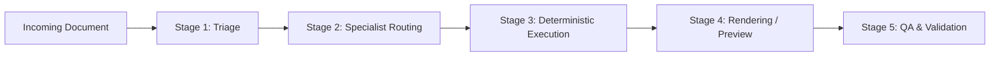

# Document Router: Universal Document Operating System

The **Document Router** is the master coordinator for all document-related operations in Antigravity. It enforces a strict **Triage &rarr; Route &rarr; Execute &rarr; Render &rarr; QA** lifecycle to ensure zero data loss, structural fidelity, and error-free output.

---

## The 5-Stage Document Lifecycle



### Stage 1: Triage (Inspect Before Touching)
Before reading or editing, always determine the underlying structure of the document:
```powershell
python .agents/plugins/document-os/scripts/inspect_doc.py "<filepath>"
```
The inspection output reveals:
- Document MIME type and actual format.
- Page count (PDF), sheet count & formula summary (XLSX), slide count (PPTX), paragraph count (DOCX).
- Searchable digital text vs. scanned raster layers (determines whether OCR is required).
- Embedded images, tables, or macros.

### Stage 2: Specialist Routing
Based on the triage report, consult the appropriate format protocol in `references/`:

| Format | Primary Needs | Specialist Protocol | Primary Engine |
| :--- | :--- | :--- | :--- |
| **PDF** | Text, tables, forms, scanned pages | [pdf-protocol.md](./references/pdf-protocol.md) | `pdfplumber`, `pypdf`, Tesseract OCR |
| **DOCX** | Structured text, tables, styles, headers | [docx-protocol.md](./references/docx-protocol.md) | `python-docx`, Pandoc, LibreOffice |
| **XLSX** | Data, formulas, multi-sheet, charts | [xlsx-protocol.md](./references/xlsx-protocol.md) | `openpyxl`, `pandas`, `xlsxwriter` |
| **PPTX** | Slide decks, layouts, shapes, themes | [pptx-protocol.md](./references/pptx-protocol.md) | `python-pptx`, LibreOffice |
| **Images** | Scanned text, diagrams, receipts | [image-ocr-protocol.md](./references/image-ocr-protocol.md) | Multimodal Vision + Tesseract OCR |
| **Conversion**| Cross-format migration | [conversion-matrix.md](./references/conversion-matrix.md) | Pandoc & Headless LibreOffice |

### Stage 3: Deterministic Execution
Use the built-in CLI helper scripts or targeted Python libraries:

1. **Text & Table Extraction**:
   ```powershell
   # Extract plain text
   python .agents/plugins/document-os/scripts/extract_doc.py "<file>" --type text
   
   # Extract tables as Markdown
   python .agents/plugins/document-os/scripts/extract_doc.py "<file>" --type tables
   
   # Extract embedded images
   python .agents/plugins/document-os/scripts/extract_doc.py "<file>" --type images --outdir "./extracted_media"
   ```

2. **Cross-Format Conversion**:
   ```powershell
   # Headless Office -> PDF, or Markdown -> DOCX
   python .agents/plugins/document-os/scripts/convert_doc.py "<input_file>" "<output_file>"
   ```

3. **OCR on Scanned Documents or Images**:
   ```powershell
   python .agents/plugins/document-os/scripts/ocr_doc.py "<image_or_scanned_pdf>" --lang eng
   ```

### Stage 4: Rendering & Visual Verification
When formatting, layout, or typography matters (PDF, PPTX, DOCX):
```powershell
python .agents/plugins/document-os/scripts/render_doc.py "<file>" --outdir "./artifacts/previews"
```
Inspect the rendered slide or page images to confirm layouts are not clipped and fonts are intact.

### Stage 5: Mandatory QA Verification
Never present a document operation as complete without running automated QA:
```powershell
python .agents/plugins/document-os/scripts/qa_doc.py "<output_file>"
```
See the companion skill [document-qa](../document-qa/SKILL.md) for full acceptance criteria.
