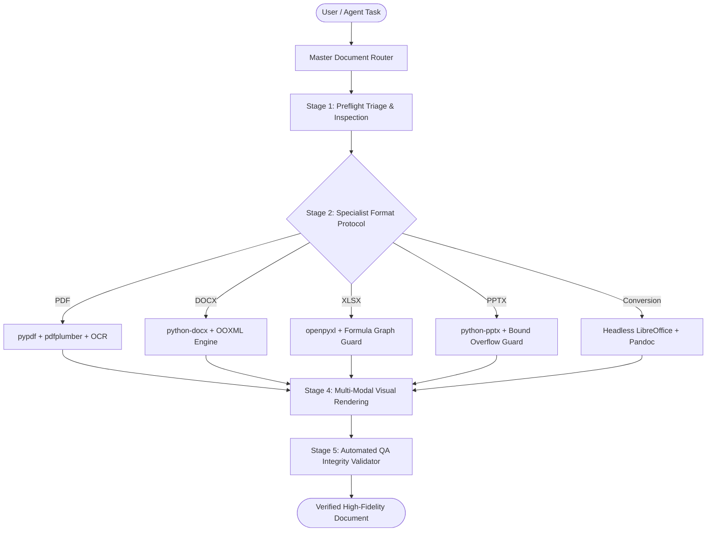

# 📄 AI Agents Document Operating System (Document OS)

[](https://opensource.org/licenses/MIT)
[](https://cloud.google.com)
[](https://anthropic.com)
[](https://github.com/ekpootu/ai-agents-document-os)
[](CONTRIBUTING.md)
[](https://www.buymeacoffee.com/ekpootu)

> **The Universal Document Operating System for AI Agents.**  
> Stop LLM document hallucinations, broken spreadsheet formulas, destroyed layouts, and corrupt OOXML files. Give your agents a deterministic, high-fidelity engineering substrate for `.pdf`, `.docx`, `.xlsx`, `.pptx`, `.md`, and OCR.

---

## 🛑 Why Document Operations in AI Agents Break

Every developer who has asked an AI agent to *"Analyze this Excel sheet"*, *"Convert this PDF to Word"*, or *"Update this corporate slide deck"* knows the sinking feeling:

1. **Dead Spreadsheet Formulas**: The agent reads an Excel sheet and spits back static numbers, silently wiping out `=SUM()`, `=VLOOKUP()`, and financial calculation graphs.
2. **Corrupted Presentations**: PowerPoint opens with a terrifying warning: *"We found a problem with some content in presentation.pptx. Do you want us to try to recover?"*
3. **Destroyed Word Layouts**: Multi-column documents, custom margins, headers, and company templates are flattened into naked Markdown text.
4. **Context Window Choking**: Feeding a 200-page scanned PDF into context blows token budgets, resulting in hallucinated summaries and massive inference bills.
5. **Zero Accountability**: Agents declare *"I have updated your document!"* without ever testing if the generated file actually opens.

---

## 💡 A Deterministic Operating System for Documents

Instead of relying on LLM memory to write raw, one-off scripts, **Document OS** introduces an engineering-grade operating system for documents:



- 🔍 **Triage First**: Analyzes digital text vs scanned layers, formula trees, and sheet layouts before touching data.
- 🛡️ **Zero Unintentional Data Loss**: Read-only by default; versioned outputs; formulas protected.
- ⚡ **Deterministic CLI Helpers**: Tested, standalone Python CLI tools (`inspect`, `extract`, `convert`, `render`, `qa`).
- 👁️ **Visual QA & Multi-Modal Verification**: Renders generated pages and slides to high-resolution PNGs so the agent can visually inspect its work.
- 🌐 **Cross-Harness Freedom**: Native in Google Antigravity, 1-click exportable to Claude Code, OpenCode CLI, Cursor, and Cline.

---

## 🔰 Beginner's Guide: Where, When & How to Start

If you are new to AI agents or Document OS, here is everything you need to know in plain English:

### 1. Where Does It Run?
Document OS lives inside your project repository under `.agents/plugins/document-os/`. All scripts execute locally and securely on your computer using Python. No document data or confidential spreadsheets are ever transmitted to third-party cloud servers.

### 2. How to Use Across Different AI Agent Harnesses

| Harness / Tool | How to Activate & Use |
| :--- | :--- |
| **Google Antigravity** | Document OS is loaded automatically via `.agents/`. When you ask Antigravity to work on documents, it invokes the `document-router` skill and runs deterministic CLI scripts. |
| **Claude Code** | Run `.\export_cross_harness.ps1 -Target ClaudeCode` once. Claude Code reads instructions from `.claude/skills/` and executes the scripts seamlessly. |
| **Cursor / VS Code** | Open your project, activate your virtual environment, and ask Cursor Composer or Chat: *"Use Document OS to inspect invoice.pdf and extract tables into Markdown."* |
| **OpenCode CLI / Cline / Codex** | OpenCode and Cline automatically discover rules in `AGENTS.md`. Agents follow the standardized execution commands outlined below. |

### 3. Practical Tool Decision Table (When to Run Which Script)

| Your Goal / File Type | CLI Script to Execute | What It Does Under the Hood |
| :--- | :--- | :--- |
| **Unknown or new file** | `python .agents/plugins/document-os/scripts/inspect_doc.py <file>` | Detects digital vs scanned PDF, dynamic Excel formulas, Word styles, and slide geometry. |
| **Extract data or tables** | `python .agents/plugins/document-os/scripts/extract_doc.py <file> --type tables` | Uses `pdfplumber` for tabular data or `openpyxl` for spreadsheets without touching formatting. |
| **Convert between formats** | `python .agents/plugins/document-os/scripts/convert_doc.py <in> <out>` | Headless LibreOffice / Pandoc conversion with layout preservation. |
| **Visual QA / Inspection** | `python .agents/plugins/document-os/scripts/render_doc.py <file> --outdir ./previews` | Converts PDF pages or PPTX slides to PNG for visual agent inspection. |
| **Scanned documents & OCR** | `python .agents/plugins/document-os/scripts/ocr_doc.py <image_or_pdf>` | Extracts text using Tesseract OCR with adaptive image preprocessing. |
| **Pre-completion Verification**| `python .agents/plugins/document-os/scripts/qa_doc.py <file>` | Audits document for corrupt XML tags, broken formulas (`#REF!`), and broken hyperlinks. |

---

## 🚀 Quickstart & Installation

### Option 1: 1-Click Automated Setup (Windows)

Open PowerShell in your project directory:

```powershell
# Installs Python venv, core packages, and runs diagnostic self-tests
.\install_document_os.ps1

# To also deploy globally across all Antigravity projects:
.\install_document_os.ps1 -DeployGlobal
```

### Option 2: Linux / macOS Setup

```bash
chmod +x install_document_os.sh
./install_document_os.sh
```

### Option 3: Cross-Harness Skill Export

```powershell
# Export skills to Claude Code
.\export_cross_harness.ps1 -Target ClaudeCode

# Export skills to OpenCode CLI
.\export_cross_harness.ps1 -Target OpenCode
```

---

## 🛠️ Core CLI Commands

Document OS provides battle-tested CLI tools ready for agents and humans alike:

```bash
# 1. Triage any document format
python .agents/plugins/document-os/scripts/inspect_doc.py report.pdf

# 2. Extract tables into clean Markdown
python .agents/plugins/document-os/scripts/extract_doc.py financial_model.xlsx --type tables

# 3. Headless cross-format conversion
python .agents/plugins/document-os/scripts/convert_doc.py pitch.pptx pitch.pdf

# 4. Render pages/slides to PNG for visual QA
python .agents/plugins/document-os/scripts/render_doc.py pitch.pdf --outdir ./previews

# 5. Extract text from scanned images/PDFs with adaptive OCR
python .agents/plugins/document-os/scripts/ocr_doc.py receipt.png --output receipt_text.txt

# 6. Validate document integrity & scan formula errors
python .agents/plugins/document-os/scripts/qa_doc.py final_budget.xlsx
```

---

## 📖 Dogfooded Official Guide

We don't just talk about document fidelity; we prove it. The complete **AI Agents Document OS Comprehensive User Guide v5.0** was generated using our professional PDF engine with embedded Google Fonts (Playfair Display + Source Sans 3), brand-consistent styling, clickable Table of Contents, exact 1.6:1 height-to-width ratio, and Amazon KDP publishing-grade formatting.

👉 **[Download the Official PDF User Guide v5.0](docs/AI_Agents_Document_OS_Comprehensive_Guide_v5.pdf)**

### Document Generation Engines

- **WeasyPrint** (Primary Engine): CSS Paged Media engine for semantic HTML+CSS to PDF compilation. Generates fluid, multi-section page flows without artificial page-break voids, complete with running headers, footers, and Amazon KDP 1.6:1 aspect ratio.
- **ReportLab** (Secondary Engine): Precision programmatic PDF builder with embedded Google Fonts, custom vector canvases, and automated table formatting. Serves as our zero-dependency, ultra-reliable fallback engine whenever native GTK3 runtimes are absent.

---

## 🎨 Brand Identity System

Document OS includes a built-in **Brand Identity Skill** that enforces consistent visual standards across documents and web interfaces:

- **Colors**:
  - **Forest Deep Teal**: `#033C45` (Primary brand color)
  - **Artisan Gold**: `#C6A965` (Accent & highlights)
  - **Sage Mint**: `#D8ECE9` (Light container background)
  - **Ivory Parchment**: `#F8F1E9` (Page background & cards)
  - **Dark Slate Navy**: `#06181B` (Deep typography & dark mode)
- **Fonts**: Playfair Display (headings), Source Sans 3 (body/interface), JetBrains Mono (code)
- **Page Layout**: Amazon KDP-compliant margins and fluid section formatting (1.6:1 ratio: `6.0" x 9.6"`)
- **Design Tokens**: Machine-readable JSON at `.agents/skills/brand-identity/resources/brand-tokens.json`

---

## 🤝 Community & Support

- ⭐ **Star this repository** if you believe AI agents deserve reliable document tools.
- 🍴 **Fork and contribute** new format specialists and validation routines (see [CONTRIBUTING.md](CONTRIBUTING.md)).
- ☕ **Support Development**: If this project saved your spreadsheets or presentations, consider [Buying Me a Coffee](https://www.buymeacoffee.com/ekpootu) to fuel ongoing maintenance.

---

## 👤 Author

**[Ekpo Otu, Ph.D.](https://linktr.ee/ekpootu)** — Computer Professional, Full Stack Developer, Researcher, Author & Lecturer.

- 🔗 [Linktree](https://linktr.ee/ekpootu) • 💻 [GitHub](https://github.com/ekpootu) • ☕ [Buy Me a Coffee](https://www.buymeacoffee.com/ekpootu)
