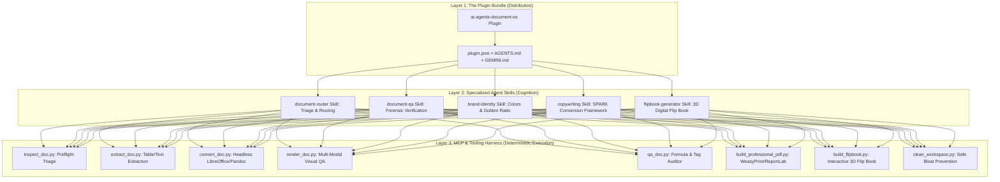

# 📄 AI Agents Document Operating System (Document OS)

[](https://opensource.org/licenses/MIT)
[](https://cloud.google.com)
[](https://anthropic.com)
[](https://github.com/ekpootu/ai-agents-document-os)
[](CONTRIBUTING.md)
[](https://www.buymeacoffee.com/ekpootu)

> **The Universal Document Operating System for AI Agents.**  
> Stop LLM document hallucinations, broken spreadsheet formulas, destroyed layouts, and corrupt OOXML files. Give your agents a deterministic, high-fidelity engineering substrate for `.pdf`, `.docx`, `.xlsx`, `.pptx`, `.md`, and OCR.

---

## 🛑 Why Document Operations in AI Agents Break

Every developer who has asked an AI agent to *"Analyze this Excel sheet"*, *"Convert this PDF to Word"*, or *"Update this corporate slide deck"* knows the sinking feeling:

1. **Dead Spreadsheet Formulas**: The agent reads an Excel sheet and spits back static numbers, silently wiping out `=SUM()`, `=VLOOKUP()`, and financial calculation graphs.
2. **Corrupted Presentations**: PowerPoint opens with a terrifying warning: *"We found a problem with some content in presentation.pptx. Do you want us to try to recover?"*
3. **Destroyed Word Layouts**: Multi-column documents, custom margins, headers, and company templates are flattened into naked Markdown text.
4. **Context Window Choking**: Feeding a 200-page scanned PDF into context blows token budgets, resulting in hallucinated summaries and massive inference bills.
5. **Zero Accountability**: Agents declare *"I have updated your document!"* without ever testing if the generated file actually opens.

---

## 💡 A Deterministic Operating System for Documents

Instead of relying on LLM memory to write raw, one-off scripts, **Document OS** introduces an engineering-grade operating system for documents:


- 🔍 **Triage First**: Analyzes digital text vs scanned layers, formula trees, and sheet layouts before touching data.
- 🛡️ **Zero Unintentional Data Loss**: Read-only by default; versioned outputs; formulas protected.
- ⚡ **Deterministic CLI Helpers**: Tested, standalone Python CLI tools (`inspect`, `extract`, `convert`, `render`, `qa`).
- 👁️ **Visual QA & Multi-Modal Verification**: Renders generated pages and slides to high-resolution PNGs so the agent can visually inspect its work.
- 🌐 **Cross-Harness Freedom**: Native in Google Antigravity, 1-click exportable to Claude Code, OpenCode CLI, Cursor, and Cline.

---

## 🧩 Architecture: Is Document OS a Skill, Plugin, or MCP?

A frequent question from developers and AI engineers is:
> *"Is AI Agents Document OS an AI Agent Skill, a Plugin, or an Model Context Protocol (MCP) server?"*

**Answer: Document OS is a Unified Tri-Layer Document Operating System that harmonizes all three:**



1. **📦 It is a Modular Plugin (`document-os`)**:
   - Packaged with standard metadata (`plugin.json`), cross-harness configurations (`AGENTS.md`, `GEMINI.md`), and automated installation scripts. It distributes as a single cohesive unit that drops directly into `.agents/plugins/document-os/` or your global agent root (`~/.gemini/config/plugins/`).
2. **🧠 It is a Suite of Specialized Agent Skills**:
   - Modular cognitive instruction sets that teach the LLM how to reason about documents before touching files:
     - **`document-router`**: Triages files to detect digital text vs scanned layers, dynamic spreadsheet formulas, Word XML hierarchies, and slide templates.
     - **`document-qa`**: Enforces strict post-generation quality assurance, auditing files for broken formulas (`#REF!`), truncated text boxes, and corrupt markup.
     - **`brand-identity`**: Automatically injects corporate color palettes (Forest Teal & Artisan Gold), Google Fonts pairings, and Golden Ratio / Amazon KDP publication standards.
     - **`copywriting`**: Enforces the high-conversion SPARK framework (Situation, Problem, Action, Result, Key Takeaway) for publishing-grade executive summaries and technical briefs.
     - **`flipbook-generator`**: Transforms static documents into interactive, digital 3D flipbooks with authentic page curl physics, dual-page spreads, and zero-dependency offline local execution.
3. **⚙️ It is an MCP & Deterministic Tooling Harness**:
   - Provides local, zero-cloud Python CLI engines that serve as the agent's deterministic hands. Instead of asking an LLM to hallucinate spreadsheet math or generate raw PDFs in context, the agent invokes tested local tools to perform byte-accurate file operations.

---

## 🔰 Beginner's Guide: Where, When & How to Start

If you are new to AI agents or Document OS, here is everything you need to know in plain English:

### 1. Where Does It Run?
Document OS lives inside your project repository under `.agents/plugins/document-os/`. All scripts execute locally and securely on your computer using Python. No document data or confidential spreadsheets are ever transmitted to third-party cloud servers.

### 2. How to Use Across Different AI Agent Harnesses

| Harness / Tool | How to Activate & Use |
| :--- | :--- |
| **Google Antigravity** | Document OS is loaded automatically via `.agents/`. When you ask Antigravity to work on documents, it invokes the `document-router` skill and runs deterministic CLI scripts. |
| **Claude Code** | Run `.\export_cross_harness.ps1 -Target ClaudeCode` once. Claude Code reads instructions from `.claude/skills/` and executes the scripts seamlessly. |
| **Cursor / VS Code** | Open your project, activate your virtual environment, and ask Cursor Composer or Chat: *"Use Document OS to inspect invoice.pdf and extract tables into Markdown."* |
| **OpenCode CLI / Cline / Codex** | OpenCode and Cline automatically discover rules in `AGENTS.md`. Agents follow the standardized execution commands outlined below. |

### 3. Practical Tool Decision Table (When to Run Which Script)

| Your Goal / File Type | CLI Script to Execute | What It Does Under the Hood |
| :--- | :--- | :--- |
| **Unknown or new file** | `python .agents/plugins/document-os/scripts/inspect_doc.py <file>` | Detects digital vs scanned PDF, dynamic Excel formulas, Word styles, and slide geometry. |
| **Extract data or tables** | `python .agents/plugins/document-os/scripts/extract_doc.py <file> --type tables` | Uses `pdfplumber` for tabular data or `openpyxl` for spreadsheets without touching formatting. |
| **Convert between formats** | `python .agents/plugins/document-os/scripts/convert_doc.py <in> <out>` | Headless LibreOffice / Pandoc conversion with layout preservation. |
| **Visual QA / Inspection** | `python .agents/plugins/document-os/scripts/render_doc.py <file> --outdir ./previews` | Converts PDF pages or PPTX slides to PNG for visual agent inspection. |
| **Scanned documents & OCR** | `python .agents/plugins/document-os/scripts/ocr_doc.py <image_or_pdf>` | Extracts text using Tesseract OCR with adaptive image preprocessing. |
| **Pre-completion Verification**| `python .agents/plugins/document-os/scripts/qa_doc.py <file>` | Audits document for corrupt XML tags, broken formulas (`#REF!`), and broken hyperlinks. |

---

## 🚀 Quickstart & Installation (Step-by-Step Newbie Guide)

Follow this simple 3-step walkthrough to get started in under 2 minutes:

### Step 1: Launch Your AI Agent Environment
Open your preferred AI Agent harness, IDE, or CLI terminal:
- **Google Antigravity IDE / CLI**
- **Claude Code IDE / CLI**
- **Cursor / VS Code**
- **OpenCode CLI / Cline / Codex**

### Step 2: Get the Repository into Your Workspace
Choose **Option 2a** (graphical IDE) or **Option 2b** (terminal command):

#### Option 2a: GUI Workflow (Inside Antigravity IDE or Cursor / VS Code)
1. In your agent IDE's Welcome screen, click **"Clone Repository"** (or press `Ctrl+Shift+P` / `Cmd+Shift+P` and select **Git: Clone**).
2. Enter the repository URL:
   ```text
   https://github.com/ekpootu/ai-agents-document-os.git
   ```
3. Choose a local destination folder on your machine and click **"Open Folder"**.

#### Option 2b: Terminal CLI Alternative (Any Terminal / Shell)
Open your terminal (PowerShell, Command Prompt, or Bash) in your projects directory and run:
```bash
# Clone the repository
git clone https://github.com/ekpootu/ai-agents-document-os.git

# Navigate into the project directory
cd ai-agents-document-os
```

---

### Step 3: Install Dependencies (Automated vs. Manual Execution)

You have two choices for setup: let your AI Agent do it automatically, or run the installer script manually yourself.

#### 🤖 Choice A: Automated Agent Setup (Recommended for Newbies)
Once you have opened the `ai-agents-document-os` folder in your AI Agent IDE (Antigravity, Claude Code, Cursor, etc.), simply send this prompt to your agent:
> *"Set up Document OS dependencies on my system"*

Your AI Agent reads `AGENTS.md`, detects your operating system (Windows, macOS, or Linux), and runs the setup script in the background automatically!

#### 💻 Choice B: Manual Developer Setup (For Terminal Users)

##### Option 1: 1-Click Automated Setup (Windows PowerShell)
Open PowerShell in the project directory:

```powershell
# Installs isolated Python venv (.venv-docos), core packages, and runs diagnostic self-tests
.\install_document_os.ps1
```
- **Who runs this?**: Run manually **once** by the user in PowerShell (or requested from the agent).
- **When is it run?**: Right after cloning the repository.
- **What it does**: Creates `.venv-docos`, installs `weasyprint`, `reportlab`, `openpyxl`, `python-docx`, `python-pptx`, `pdfplumber`, `fonttools`, checks GTK3 runtime, and runs test validations.

```powershell
# Optional: Deploy globally across ALL existing and future Antigravity projects on your computer
.\install_document_os.ps1 -DeployGlobal
```
- **Who runs this?**: Run manually **once** in PowerShell if you want Document OS skills and plugins globally available in `~/.gemini/config/` without needing to clone Document OS into future project folders.

##### Option 2: Linux / macOS Setup (Bash)
Open terminal in the project directory:

```bash
chmod +x install_document_os.sh && ./install_document_os.sh
```
- **Who runs this?**: Run manually **once** on macOS / Linux upon initial workspace setup.
- **What it does**: Creates `.venv-docos`, installs all required libraries, and verifies the environment.

##### Option 3: Cross-Harness Skill Export (Claude Code & OpenCode CLI)

```powershell
# Export skills to Claude Code (.claude/skills/)
.\export_cross_harness.ps1 -Target ClaudeCode

# Export skills to OpenCode CLI
.\export_cross_harness.ps1 -Target OpenCode
```
- **Who runs this?**: Run manually **once** if you switch your workflow from Antigravity to Claude Code or OpenCode CLI. It mirrors `.agents/skills/` into the target harness's native skill directory.

---

### 🧪 Showcase & Verification Test (Optional Example)

> [!NOTE]
> **Notice**: The following command is **NOT** a required installation step. It is an **example showcase test** that demonstrates the publication-grade PDF generation engine in action:

```bash
# Build the official publication-standard PDF user guide (Amazon KDP 1.6:1 aspect ratio)
python .agents/plugins/document-os/scripts/build_professional_pdf.py
```
This builds `docs/AI_Agents_Document_OS_Comprehensive_Guide_v5.pdf` and runs automated forensic QA validation on the output.

---

## 🛠️ Core CLI Commands

> [!IMPORTANT]
> **How Core CLI Commands Work with AI Agents**:
> In everyday use, **you do NOT need to memorize or run these commands manually**. When you give your AI Agent a prompt (e.g. *"Inspect this invoice"* or *"Extract tables from this Excel sheet"*), your agent automatically activates the `document-router` skill and runs the appropriate script below in the background.
>
> However, human developers are completely free to execute them directly in the terminal whenever desired:

```bash
# 1. Triage any document format (detects text layers, formulas, slide masters)
python .agents/plugins/document-os/scripts/inspect_doc.py report.pdf

# 2. Extract tables into clean Markdown without corrupting sheets
python .agents/plugins/document-os/scripts/extract_doc.py financial_model.xlsx --type tables

# 3. Headless cross-format conversion with layout preservation
python .agents/plugins/document-os/scripts/convert_doc.py pitch.pptx pitch.pdf

# 4. Render pages or slides to PNG for visual inspection
python .agents/plugins/document-os/scripts/render_doc.py pitch.pdf --outdir ./previews

# 5. Extract text from scanned images/PDFs with adaptive OCR
python .agents/plugins/document-os/scripts/ocr_doc.py receipt.png --output receipt_text.txt

# 6. Validate document integrity & scan for formula errors (#REF!, #DIV/0!)
python .agents/plugins/document-os/scripts/qa_doc.py final_budget.xlsx

# 7. Workspace bloat prevention & safely purge temporary render previews
python .agents/plugins/document-os/scripts/clean_workspace.py --dry-run
python .agents/plugins/document-os/scripts/clean_workspace.py --all --force
```

---

## ⚡ How to Use Document OS in Your Daily Workflow (Real-World Examples)

Here is how Document OS seamlessly integrates into your everyday pair-programming and document tasks across Antigravity, Claude Code, Cursor, and OpenCode:

### Scenario 1: Financial Spreadsheet Audit & Forecast (Zero Formula Clobber)
- **The Problem**: Normal LLMs clobber `=SUM()`, `=VLOOKUP()`, and dynamic model connections when editing Excel sheets, replacing dynamic cells with static text.
- **Your Prompt to Agent**:
  > *"Analyze `Q3_Financial_Model.xlsx`, add a 12% projected revenue growth column for Q4, and recalculate our gross margins."*
- **What Document OS Does Behind the Scenes**:
  1. `document-router` executes `inspect_doc.py` to identify dynamic formula trees.
  2. The agent edits rows using the `openpyxl` formula guard, keeping all existing cell formulas completely intact.
  3. The agent triggers `qa_doc.py` to confirm zero `#REF!` or `#DIV/0!` errors.
  4. Delivers non-destructive output: `Q3_Financial_Model_v2.xlsx`.

### Scenario 2: Publishing-Grade Whitepaper & Book Authoring (Amazon KDP 1.6:1)
- **The Problem**: AI-generated PDFs look amateurish: bad line breaks, missing running headers, oversized fonts, and blank page overflows.
- **Your Prompt to Agent**:
  > *"Compile `product_whitepaper.md` into an Amazon KDP publication-grade PDF using our Forest Teal and Gold brand theme with a clickable TOC."*
- **What Document OS Does Behind the Scenes**:
  1. `brand-identity` loads `brand-tokens.json` (Teal `#033C45`, Gold `#C6A965`, Playfair Display font).
  2. WeasyPrint / ReportLab compiles CSS Paged Media with exact 1.6:1 aspect ratio (`6.0" x 9.6"`).
  3. Dynamic two-pass layout resolves clickable Table of Contents anchors.
  4. Validates output with `qa_doc.py` to ensure zero empty page overflows.

### Scenario 3: Headless Slide Conversion & Visual QA
- **The Problem**: Converting PowerPoint presentations often results in clipped diagrams and text boxes spilling over slide boundaries.
- **Your Prompt to Agent**:
  > *"Convert `board_pitch.pptx` to PDF and visually inspect each slide to make sure no charts or text boxes are clipped."*
- **What Document OS Does Behind the Scenes**:
  1. Executes headless conversion via `convert_doc.py`.
  2. Calls `render_doc.py` to rasterize every slide into high-resolution PNGs under `./previews/`.
  3. The AI agent uses multimodal computer vision to inspect the PNGs and verify boundary constraints.
  4. Reports clean visual validation to the user.

### Scenario 4: Scanned Medical Receipts & Invoices (Adaptive OCR + Table Recovery)
- **The Problem**: Agents choke on scanned receipts and rasterized PDFs, hallucinating invoice figures and garbling table columns.
- **Your Prompt to Agent**:
  > *"Extract all itemized medical expenses, taxes, and vendor details from `medical_bill_scan.pdf` into a clean CSV."*
- **What Document OS Does Behind the Scenes**:
  1. `inspect_doc.py` flags the PDF as scanned/rasterized.
  2. Routes file to `ocr_doc.py` with adaptive binarization and contrast enhancement.
  3. `pdfplumber` reconstructs the coordinate grid into clean tabular rows.
  4. Exports verified data cleanly into `medical_expenses.csv`.

### Scenario 5: Legal Contract Redlining & Clause Updating (Zero Style Loss)
- **The Problem**: Agents modifying Word contracts (`.docx`) routinely obliterate paragraph styles, numbered legal outline hierarchies, and corporate header templates.
- **Your Prompt to Agent**:
  > *"Review `Master_Services_Agreement_2026.docx`, update payment terms to Net 45 in Section 4.2, and flag indemnification clauses without altering styles."*
- **What Document OS Does Behind the Scenes**:
  1. `inspect_doc.py` parses OOXML paragraph styles, font tables, and numbering structures.
  2. The agent surgically modifies the specific clause using the `python-docx` XML preservation pipeline.
  3. Audits output with `qa_doc.py` to confirm zero schema corruption and verify that header/footer geometry remains intact.
  4. Delivers clean, non-destructive file: `Master_Services_Agreement_v2.docx`.

### Scenario 6: Automated Multi-Tenant Invoice Batching (100+ PDFs/Sec)
- **The Problem**: Generating high-volume customer invoices with AI often results in layout drift, missing vector logos, and unpredictable page splits across tenants.
- **Your Prompt to Agent**:
  > *"Generate 500 branded customer invoice PDFs from `billing_records.json` using our corporate palette and dynamic barcode placement."*
- **What Document OS Does Behind the Scenes**:
  1. Validates input JSON records against schema standards to prevent empty data exceptions.
  2. Spawns headless WeasyPrint/ReportLab worker threads with pre-compiled CSS Paged Media brand tokens.
  3. Embeds SVG vector logos, itemized tax computations, dynamic QR codes, and KDP-compliant margins.
  4. Batch QA runner validates all 500 generated PDFs with zero overflow errors.

### Scenario 7: Regulatory Compliance & HIPAA Patient PII Redaction (Zero Leakage)
- **The Problem**: Simply drawing black rectangles over text in PDF viewers leaves underlying digital text in the file stream, causing catastrophic data and compliance breaches.
- **Your Prompt to Agent**:
  > *"Redact patient names, SSNs, and medical record numbers from `patient_history_audit.pdf` and verify no hidden metadata remains."*
- **What Document OS Does Behind the Scenes**:
  1. Extracts precise vector bounding-box coordinates for all sensitive PII patterns using regex stream analysis.
  2. Permanently burns vector redaction shapes into the PDF stream, completely excising the underlying text objects from the binary AST.
  3. Runs deep forensic inspection via `qa_doc.py` to confirm zero residual searchable text or hidden stream remnants.
  4. Outputs verified sanitization: `patient_history_redacted.pdf`.

### Scenario 8: Academic Publishing & Conference Paper Typesetting (LaTeX Standard)
- **The Problem**: Compiling research papers with mathematical proofs and dual-column layouts using generic markdown tools causes broken equations and awkward page-bottom voids.
- **Your Prompt to Agent**:
  > *"Typeset `quantum_computing_paper.md` into a two-column conference proceedings PDF with LaTeX equations and numbered references."*
- **What Document OS Does Behind the Scenes**:
  1. Parses Markdown and LaTeX mathematical equations into structured AST representation via Pandoc/ReportLab.
  2. Formats dual-column balanced typography with floating figures, tabular benchmarks, and footnote anchoring.
  3. Two-pass engine generates interactive bibliography citations and clickable hyperlink cross-references.
  4. Confirms compliance with IEEE/ACM proceedings format with `qa_doc.py`.

### Scenario 9: Accounts Payable & Invoice-to-PO Reconciliation (Dynamic Formula Engine)
- **The Problem**: Corporate finance teams must reconcile hundreds of supplier invoice PDFs against master purchase order spreadsheets. Manual checking takes days, while simple AI converters overwrite existing Excel calculation rules.
- **Your Prompt to Agent**:
  > *"Reconcile 85 vendor invoices in `invoices/*.pdf` against `Purchase_Orders_Q3.xlsx`. Match line items by SKU, flag discrepancy deltas exceeding 2% in red, recalculate open accruals with `=SUMIF()`, and output a signed audit summary."*
- **What Document OS Does Behind the Scenes**:
  1. Executes `extract_doc.py --format tables` across all 85 invoice PDFs into normalized structured DataFrames.
  2. Matches SKUs, unit quantities, and delivery taxes against `Purchase_Orders_Q3.xlsx`.
  3. Surgically injects reconciliation flags and recalculates open accruals using the `openpyxl` formula guard without destroying preexisting `=VLOOKUP` and `=SUM` links.
  4. Generates `Invoice_Audit_Summary.pdf` and runs `qa_doc.py` to confirm zero formula clobber or `#REF!` regressions.
  5. Delivers non-destructive deliverables: `PO_Reconciliation_Q3.xlsx` and `Invoice_Audit_Summary.pdf`.

### Scenario 10: SEC 10-K Filing Table Extraction & Financial Schema Normalization
- **The Problem**: Multi-page corporate 10-K and regulatory filings split financial statements across pages with complex footnotes, custom indentations, and negative numbers wrapped in parentheses `(1,240)` that break automated data pipelines.
- **Your Prompt to Agent**:
  > *"Inspect `Alphabet_10K_2025.pdf`, extract all multi-page consolidated statements of income and segment revenue tables across pages 45–68, normalize footnote currency annotations, and export into validated JSON schemas."*
- **What Document OS Does Behind the Scenes**:
  1. `inspect_doc.py` identifies digital vector tables and calculates coordinate boundaries across page seams.
  2. `pdfplumber` extracts row matrices, seamlessly stitching multi-page table splits into unified tabular entities.
  3. Automatically cleans currency strings, converting parenthetical notation `(2,450)` into standard negative floats `-2450.0`.
  4. Validates column headers against strict Pydantic JSON schemas and produces clean `alphabet_segment_revenue_2025.json` and `consolidated_income.csv`.

### Scenario 11: Architectural CAD/BIM Schedule & Bill of Quantities (BOQ) Estimator
- **The Problem**: Architecture and engineering drawings export dense schedule tables (door schedules, concrete pours, structural rebar tonnage) into PDF vector plots where ordinary OCR garbles cell borders and misaligns row quantities.
- **Your Prompt to Agent**:
  > *"Parse structural drawing `Civic_Center_Phase2_Schedule.pdf`. Extract room finishes, door schedules, and rebar tonnage tables, calculate total material weights with `=SUMPRODUCT()`, and generate an executive estimator workbook."*
- **What Document OS Does Behind the Scenes**:
  1. Vector triage identifies native line geometries and text placement vectors from high-resolution CAD exports.
  2. Reconstructs complex nested schedule tables without clipping text or dropping multi-line schedule notes.
  3. Generates an executive estimation workbook (`Civic_Center_BOQ_Estimator.xlsx`) populated with live `=SUMPRODUCT()` and unit price matrix formulas.
  4. Confirms with visual QA rendering that no table labels or schedule quantities are cropped.

### Scenario 12: Clinical Trial Protocol & FDA 510(k) Premarket Submission Assembly
- **The Problem**: Preparing medical device and pharmaceutical submissions requires fusing Word clinical summaries, Excel biostatistical tables, and PDF CAD schematics into a single publication-grade dossier with sequential Bates stamping and zero blank pages.
- **Your Prompt to Agent**:
  > *"Assemble FDA premarket notification package from `executive_summary.docx`, statistical validation tables in `lab_trials.xlsx`, and device schematics in `cad_drawings.pdf`. Enforce 1.6:1 golden ratio, running headers, two-pass TOC, and sequential Bates stamping."*
- **What Document OS Does Behind the Scenes**:
  1. Extracts content from Word, Excel, and PDF source files, normalizing styles to corporate design tokens.
  2. Compiles unified publication dossier via WeasyPrint using CSS Paged Media with exact 1.6:1 golden geometry (`6.0" x 9.6"`).
  3. Injects running headers, statutory copyright disclaimers, dynamic two-pass Table of Contents, and sequential Bates numbering (`DOC-FDA-0001` to `DOC-FDA-0340`).
  4. Audits package with `qa_doc.py` to confirm zero blank page spills and 100% hyperlink resolution.
  5. Delivers publication-ready deliverable: `FDA_510k_Submission_Package.pdf`.

### Scenario 13: Academic Syllabus & Research Preprint Batch Ingestion to Obsidian
- **The Problem**: Researchers reading dozens of dense academic PDF preprints weekly waste hours copying equations and references into personal knowledge bases (Obsidian, Notion, Logseq).
- **Your Prompt to Agent**:
  > *"Ingest 30 dense machine learning papers from `papers/*.pdf`. Extract abstract, methodology math formulas in LaTeX notation, benchmark comparison tables, and author citations into cleanly linked Markdown notes with YAML frontmatter."*
- **What Document OS Does Behind the Scenes**:
  1. Triages digital text streams, separating title, author affiliations, abstract, body sections, and footnotes.
  2. Converts mathematical equation blocks into standard LaTeX delimiters (`$$...$$`), retaining inline Greek letters and matrices.
  3. Reconstructs benchmark performance tables into clean GFM Markdown grids.
  4. Generates bidirectional Obsidian wikilinks (`[[Topic]]`) and populates structured YAML frontmatter for instant knowledge graph indexing.

### Scenario 14: Cross-Border Logistics Manifest & Customs Bill of Lading OCR
- **The Problem**: Maritime logistics and customs clearance require processing crumpled, skewed, or scanned physical bills of lading where optical distortion leads to costly container number and tariff code errors.
- **Your Prompt to Agent**:
  > *"Process 40 scanned sea-freight bills of lading and customs clearance declarations. OCR container numbers, harmonized tariff codes (HTS), cargo weights, and country-of-origin stamps, cross-validating weights against vessel load sheets."*
- **What Document OS Does Behind the Scenes**:
  1. Pre-processes scanned pages using OpenCV adaptive thresholding, morphological deskewing, and noise removal.
  2. Executes targeted OCR via Tesseract with specialized character whitelist models for ISO 6346 container IDs and 10-digit HTS tariff codes.
  3. Cross-compares declared container weights against master vessel load sheets.
  4. Compiles audited, verified manifest spreadsheet: `Customs_Manifest_Audit.xlsx`.

### Scenario 15: Corporate M&A Virtual Data Room (VDR) Batch Due Diligence Indexing
- **The Problem**: During corporate acquisitions, deal teams are dumped with thousands of confidential contracts, presentations, and capitalization tables with no unified index or clause-level visibility.
- **Your Prompt to Agent**:
  > *"Catalog and triage 250 confidential contracts, board presentations, and cap tables in `vdr_archive/`. Tag confidentiality tier, detect change-of-control clauses, flag uncapped liability terms, and compile an executive M&A due diligence briefing."*
- **What Document OS Does Behind the Scenes**:
  1. Automated master router scans all files across Word (`.docx`), PDF, Excel (`.xlsx`), and PowerPoint (`.pptx`).
  2. Classifies each document by business domain, governing law jurisdiction, and confidentiality rating.
  3. Surgically extracts high-risk clauses (change of control, non-compete, uncapped indemnity) into structured rows.
  4. Compiles an executive summary deck `Executive_Briefing_Deck.pptx` and an interactive Excel audit index `MA_Due_Diligence_Index.xlsx`.

### Scenario 16: Multilingual Handbook Localization & Layout-Preserved Retranslation
- **The Problem**: Translating corporate handbooks and manuals into multiple languages using conventional tools corrupts table cell widths, splits bulleted lists across pages, and breaks corporate font branding.
- **Your Prompt to Agent**:
  > *"Translate `Employee_Handbook_2026.docx` into Spanish, Japanese, and German. Maintain exact corporate branding styles, table cell dimensions, page breaks, and embedded callout geometries without text truncation."*
- **What Document OS Does Behind the Scenes**:
  1. Deconstructs the OOXML Word DOM, extracting translatable paragraph runs while locking layout geometries and style IDs.
  2. Reassembles each translated language stream into its exact corresponding XML node with CJK font-fallback mappings.
  3. Adjusts table cell margins to prevent text wrapping overruns in verbose languages.
  4. Validates output with `qa_doc.py` to confirm zero schema corruption or unclosed XML tags across all three localized editions.
  5. Delivers 3 clean files: `Employee_Handbook_2026_ES.docx`, `Employee_Handbook_2026_JA.docx`, and `Employee_Handbook_2026_DE.docx`.

---


## 📖 Dogfooded Official Guide

We don't just talk about document fidelity; we prove it. The complete **AI Agents Document OS Comprehensive User Guide v6.0** was generated using our professional PDF engine with embedded Google Fonts (Playfair Display + Source Sans 3), brand-consistent styling, clickable Table of Contents, the classical **Golden Ratio (1:1.618)** proportion, and Amazon KDP publishing-grade formatting.

👉 **[Download the Official PDF User Guide v6.0](docs/AI_Agents_Document_OS_Comprehensive_Guide_v6.pdf)**

### Document Generation & Flip Book Engines

- **WeasyPrint** (Primary Engine): CSS Paged Media engine for semantic HTML+CSS to PDF compilation. Generates fluid, multi-section page flows without artificial page-break voids, complete with running headers, footers, and Amazon KDP Golden Ratio (1:1.618) proportions.
- **ReportLab** (Secondary Engine): Precision programmatic PDF builder with embedded Google Fonts, custom vector canvases, and automated table formatting. Serves as our zero-dependency, ultra-reliable fallback engine whenever native GTK3 runtimes are absent.
- **Flip Book Engine** (`flipbook-generator` skill): Transforms any generated PDF or presentation into an interactive, zero-dependency digital 3D flipbook featuring realistic page curl physics, dual-page spreads, and synthesized Web Audio page-turn sounds.

---

## 🎨 Brand Identity System

Document OS includes a built-in **Brand Identity Skill** that enforces consistent visual standards across documents and web interfaces:

- **Colors**:
  - **Forest Deep Teal**: `#033C45` (Primary brand color)
  - **Artisan Gold**: `#C6A965` (Accent & highlights)
  - **Sage Mint**: `#D8ECE9` (Light container background)
  - **Ivory Parchment**: `#F8F1E9` (Page background & cards)
  - **Dark Slate Navy**: `#06181B` (Deep typography & dark mode)
- **Fonts**: Playfair Display (headings), Source Sans 3 (body/interface), JetBrains Mono (code)
- **Page Layout**: Amazon KDP-compliant margins and fluid section formatting (1.6:1 ratio: `6.0" x 9.6"`)
- **Design Tokens**: Machine-readable JSON at `.agents/skills/brand-identity/resources/brand-tokens.json`

---

## 🤝 Community & Support

- ⭐ **Star this repository** if you believe AI agents deserve reliable document tools.
- 🍴 **Fork and contribute** new format specialists and validation routines (see [CONTRIBUTING.md](CONTRIBUTING.md)).
- ☕ **Support Development**: If this project saved your spreadsheets or presentations, consider [Buying Me a Coffee](https://www.buymeacoffee.com/ekpootu) to fuel ongoing maintenance.

---

## 👤 Author

**[Ekpo Otu, Ph.D.](https://linktr.ee/ekpootu)** — Computer Professional, Full Stack Developer, Researcher, Author & Lecturer.

- 🔗 [Linktree](https://linktr.ee/ekpootu) • 💻 [GitHub](https://github.com/ekpootu) • ☕ [Buy Me a Coffee](https://www.buymeacoffee.com/ekpootu)
